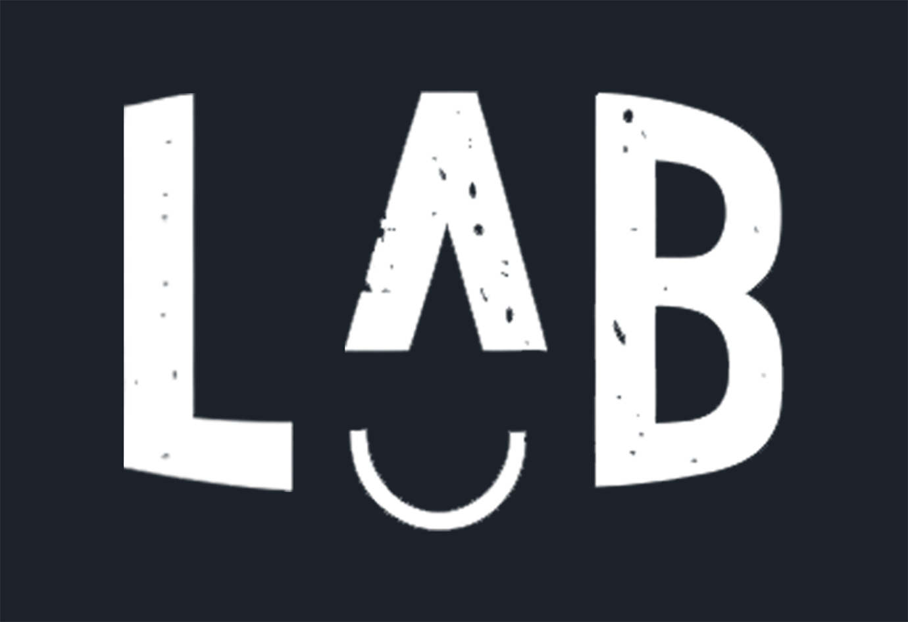

## Introduction

  

**[Lullaby Lab](https://lullaby-lab.vercel.app/)** is a simple and fast web app used to manage orders and clients of Lullaby Cake Studio.

## The Tech Stacks

- Framework: **Next.js** with TypeScript
- Database: **PostgreSQL**(supabase database)
- ORM: **Prisma**
- Authentication: **NextAuth.js**
- Deployment: **Vercel**
- Styling: **Ant Design**, **Tailwind CSS**
- Other: Chart.js

## Database ERD

  

## TODO

- [ ] Build the Dashboard Chart with Chart.js (replace Antd Chart)
- [x] use Next.js Auth
- [x] Migrate existing data from the CSV file
- [x] new Dashboard layout
- [x] Use Tailwind CSS to replace vanilla CSS
- [x] Redesign the Order Database Entity
